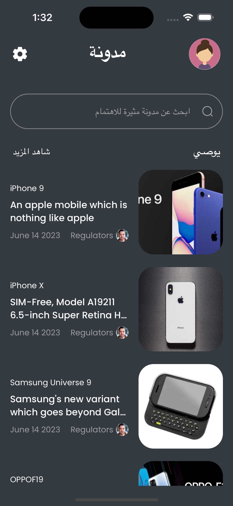
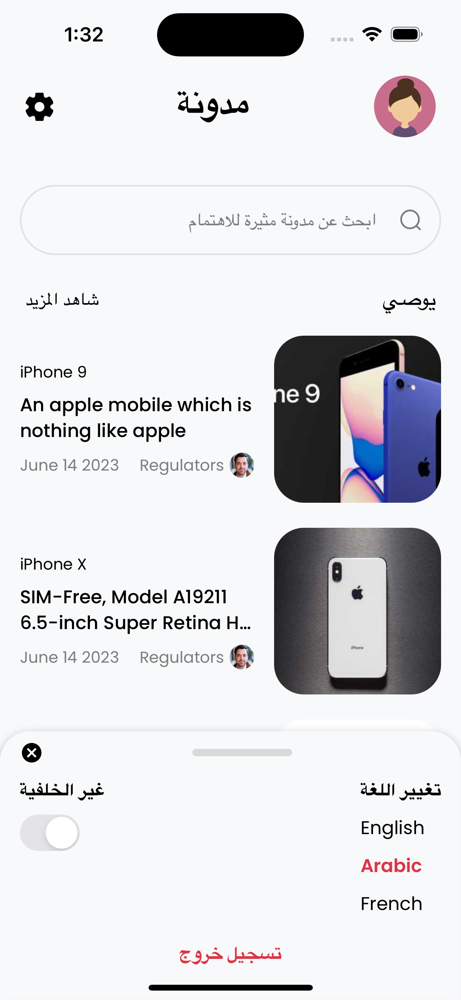
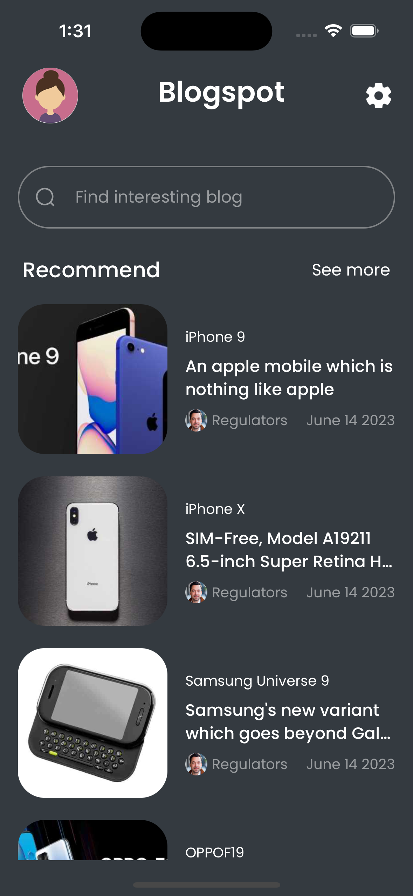
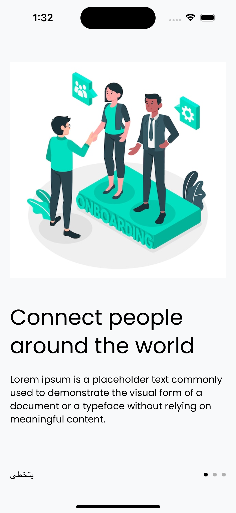
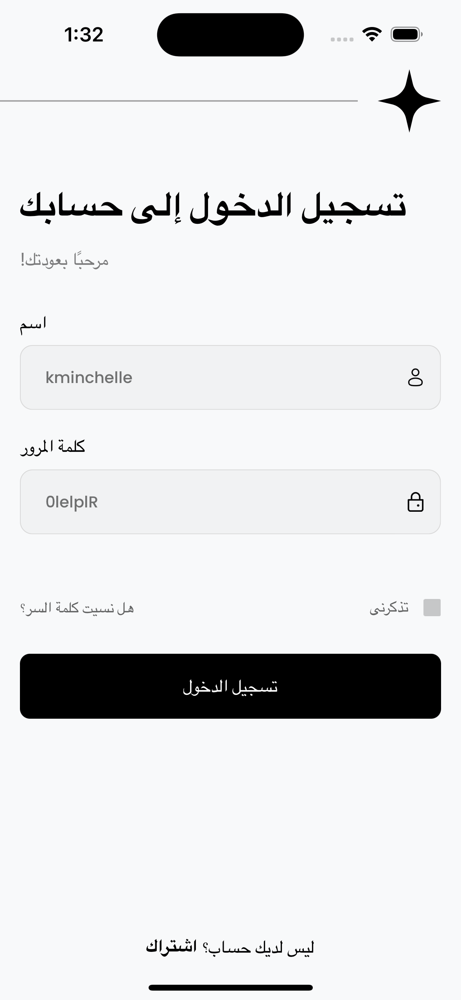
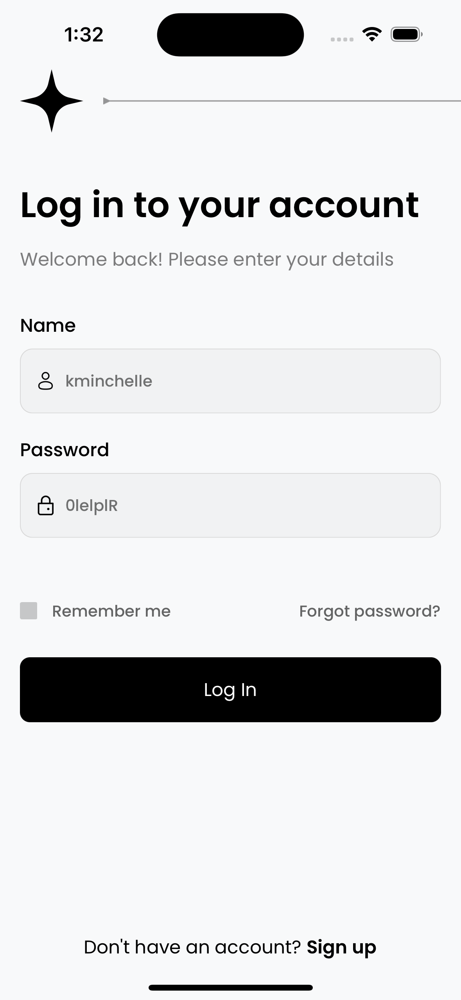

# BrewRNKit
⚛️ React Native Boilerplate: Jumpstart your app development with essential configurations for React Native projects. Includes libraries, navigation, state management, and styling setup. Streamline your workflow and focus on building amazing mobile experiences! 📱✨

<!--  -->


[](https://www.npmjs.com/package/brew-react-native-kit)

## 📱 Screenshot


  <div>
  
  
  
      
  
  
  </div>

### Preview of myapp

https://github.com/CodeBrewLabs7/myapp/assets/56266123/e9a51ea0-f056-4b14-b4ef-f01eef8cc7de


# Key Features

- **Handle Light/Dark Mode**: Built-in support for toggling between light and dark modes.
- **Localization**: Easily localize your app with internationalization support.
- **Global State Management**: Integration with Redux Toolkit for managing global state.
- **Async Data Fetching**: Utilize @tanstack/react-query for efficient asynchronous data fetching.
- **Authentication Stack**: Boilerplate includes authentication stack for user authentication.
- **Main Stack**: Configured main stack for navigation and UI structure.
- **And Many More**: Additional features and configurations to streamline development.

## Quick Start ⚡

To create a new project using the boilerplate simply run :

```
npx react-native@latest init MyApp --template brew-react-native-kit
```

## Libraries Using BrewRNKit 📚

<table>
<tr>
<td>

- [@react-navigation/native](https://www.npmjs.com/package/@react-navigation/native)
- [react-native-screens](https://www.npmjs.com/package/react-native-screens)
- [react-native-safe-area-context](https://www.npmjs.com/package/react-native-safe-area-context)
- [@react-navigation/native-stack](https://www.npmjs.com/package/@react-navigation/native-stack)
- [react-native-mmkv](https://www.npmjs.com/package/react-native-mmkv)
- [react-native-masked-view](https://github.com/react-native-masked-view/masked-view)
- [react-native-gesture-handler](https://www.npmjs.com/package/react-native-gesture-handler)

</td>

<td>
  
- [react-redux](https://www.npmjs.com/package/react-redux)
- [@reduxjs/toolkit](https://www.npmjs.com/package/@reduxjs/toolkit)
- [@tanstack/react-query](https://www.npmjs.com/package/@tanstack/react-query)
- [i18next](https://www.npmjs.com/package/i18next)
- [@os-team/i18next-react-native-language-detector](https://www.npmjs.com/package/@os-team/i18next-react-native-language-detector)
- [intl-pluralrules](https://www.npmjs.com/package/intl-pluralrules)
- [react-i18next](https://www.npmjs.com/package/react-i18next)
  
</td>
<td>
  
- [axios](https://www.npmjs.com/package/axios)
- [@testing-library/react-native](https://www.npmjs.com/package/@testing-library/react-native)
- [react-native-keyboard-aware-scroll-view](https://www.npmjs.com/package/react-native-keyboard-aware-scroll-view)
- [react-native-reanimated](https://www.npmjs.com/package/react-native-reanimated)
- [react-native-restart](https://www.npmjs.com/package/react-native-restart)
- [react-native-unistyles](https://www.npmjs.com/package/react-native-unistyles)

</td>
</tr>
</table>


## Requirements

Node 18 or greater is required. Development for iOS requires a Mac and Xcode 10 or up, and will target iOS 11 and up.

You also need to install the dependencies required by React Native.  
Go to the [React Native environment setup](https://reactnative.dev/docs/environment-setup), then select `React Native CLI Quickstart` tab.  
Follow instructions for your given `development OS` and `target OS`.


# Getting Started

>**Note**: Make sure you have completed the [React Native - Environment Setup](https://reactnative.dev/docs/environment-setup) instructions till "Creating a new application" step, before proceeding.

## Step 1: Start the Metro Server

First, you will need to start **Metro**, the JavaScript _bundler_ that ships _with_ React Native.

To start Metro, run the following command from the _root_ of your React Native project:

```bash
# using npm
npm install
npm start

# OR using Yarn
yarn install
yarn start
```

## Step 2: Start your Application

Let Metro Bundler run in its _own_ terminal. Open a _new_ terminal from the _root_ of your React Native project. Run the following command to start your _Android_ or _iOS_ app:

### For Android

```bash
# using npm
npm run android

# OR using Yarn
yarn android
```

### For iOS

```bash
# using npm
cd ios
pod install
npm run ios

# OR using Yarn
cd ios
pod install
yarn ios
```

